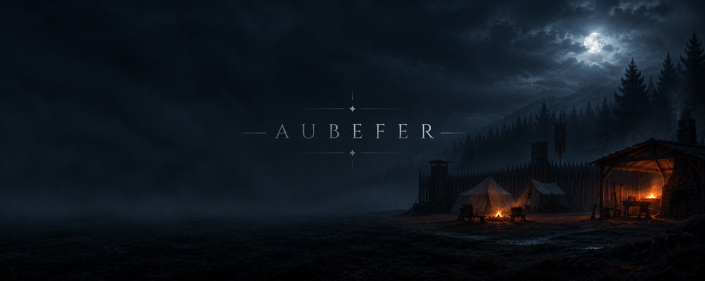

# AUBEFER



Mini-jeu en ligne de commande écrit en Go. Projet RED, B1 Informatique, Ynov Campus Aix.

Vous êtes une recrue au camp d'entraînement d'Aubefer. Vous choisissez un nom et un
lignage, vous gérez votre besace, vous achetez chez le Régisseur, et vous vous battez
contre le gobelin d'entraînement. Tout se joue au clavier, dans le terminal.

## Lancer le jeu

Il faut Go 1.21 ou plus. Aucune dépendance à installer.

```
git clone https://github.com/YujinW3b/ProjetRed_Theo_Amine_Martim.git
cd ProjetRed_Theo_Amine_Martim
go run main.go
```

## Le camp

Le menu principal est le camp. Chaque option est un lieu.

```
[1] Ta fiche de recrue
[2] Ta besace
[3] La tente du Régisseur
[4] Le terrain d'exercice
[0] Quitter le camp
```

On tape le chiffre, on valide. Toute autre saisie fait râler le Sergent, rien ne plante.

## Les lignages

| Lignage | PV max | PV au départ | Initiative |
|---|---|---|---|
| Humain | 100 | 50 | 10 |
| Elfe | 80 | 40 | 12 |
| Nain | 120 | 60 | 8 |

Une recrue commence niveau 1, avec 100 pièces d'or, trois potions de vie, le sort
Coup de poing et une besace de 10 emplacements. Les PV de départ valent la moitié du
maximum : le Sergent ne donne jamais une recrue à pleine forme.

## Organisation du code

```
main.go     lance le jeu, appelle src.Start()
src/        tout le code du jeu, en package src
docs/       gestion de projet et support de soutenance
go.mod      module aubefer
```

Un fichier par domaine, pour éviter que deux personnes travaillent au même endroit :
`game.go`, `menu.go`, `creation.go`, `character.go`, `inventory.go`, `items.go`,
`merchant.go`, `blacksmith.go`, `equipment.go`, `combat.go`, `monster.go`,
`ascii.go`, `display.go`.

## État du jeu

Les 22 tâches du sujet sont écrites. Deux d'entre elles, la Forge (`accessForgeron`)
et l'équipement (`equiperItem`), sont codées mais pas encore reliées au menu : le code
existe, un joueur ne peut pas encore y accéder.

Missions bonus livrées : combat magique, mana, habillage ASCII. L'initiative est
calculée par lignage mais ne pilote pas encore l'ordre des tours.

## L'équipe

- Théo SUGIER — menu du camp, création de personnage, combat, habillage, dépôt
- Amine KOUAIDI — besace, or, Régisseur, Forge, sorts et mana, équipement
- Martim GALHARDO — structures Character et Equipment, fiche de recrue, gobelin

Suivi des tâches sur Trello, une carte par tâche du sujet. Une branche et une pull
request par tâche, relue par un autre membre avant fusion. 93 commits sur `main`.
